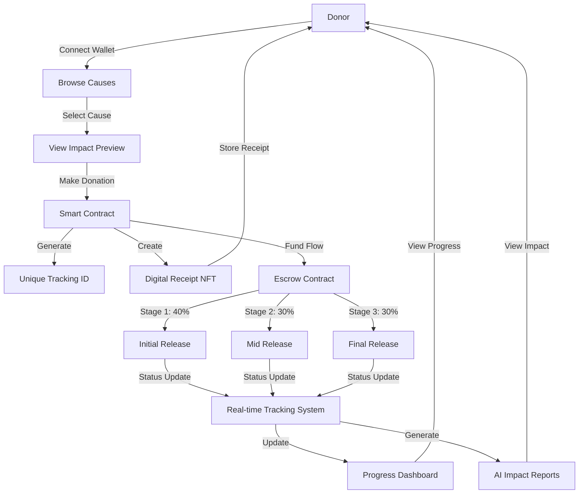

# ImpactChain - Innerve Hackathon

ImpactChain transforms traditional donations by leveraging blockchain technology to create a transparent and secure giving ecosystem.

## Overview

Our platform bridges the trust gap between donors and organizations through automated fund management and real-time tracking, ensuring every contribution creates verifiable impact.

### Key Features

- **Transparent Donations**: Blockchain technology ensures that all transactions are transparent and traceable.
- **Automated Fund Management**: Smart contracts govern the entire donation lifecycle, eliminating intermediaries and reducing administrative overhead.
- **Real-Time Tracking**: Donors can track their contributions in real-time, ensuring funds are utilized as intended.
- **NFT Receipts**: Each donation generates a unique NFT receipt that serves as both proof of contribution and a dynamic tracker, updating in real-time.

## Technologies Used

- **Solana**: Blockchain platform for decentralized applications.
- **React**: JavaScript library for building user interfaces.
- **Express**: Web application framework for Node.js.
- **Node.js**: JavaScript runtime for server-side programming.
- **MetaMask**: Cryptocurrency wallet for interacting with the Ethereum blockchain.
- **IPFS**: Decentralized file storage system.
- **MongoDB**: NoSQL database for storing application data.

## Architecture Diagram



## Getting Started

### Prerequisites

- [Node.js](https://nodejs.org/)
- [npm](https://www.npmjs.com/)

### Installation

1. Clone the repository:
    ```bash
    git clone https://github.com/kedarvartak/ImpactChain-Innerve-Hackathon.git
    ```
2. Navigate to the project directory:
    ```bash
    cd ImpactChain-Innerve-Hackathon
    ```
3. Install dependencies:
    ```bash
    npm install
    ```

## Usage

1. Start the development server:
    ```bash
    npm start
    ```
2. Open your browser and navigate to `http://localhost:3000`.

## Contributing

We welcome contributions from the community. Please fork the repository and submit pull requests.

## License

This project is licensed under the MIT License. See the [LICENSE](LICENSE) file for details.

## Contact

If you have any questions or suggestions, please open an issue or contact us at [kedar.vartak22@vit.edu].

---

Thank you for contributing to ImpactChain!
