# ImpactChain - Innerve Hackathon

ImpactChain transforms traditional donations by leveraging blockchain technology to create a transparent and secure giving ecosystem.

## Overview

Our platform bridges the trust gap between donors and organizations through automated fund management and real-time tracking, ensuring every contribution creates verifiable impact.

### Key Features

- **Transparent Donations**: Blockchain technology ensures that all transactions are transparent and traceable.
- **Automated Fund Management**: Smart contracts govern the entire donation lifecycle, eliminating intermediaries and reducing administrative overhead.
- **Real-Time Tracking**: Donors can track their contributions in real-time, ensuring funds are utilized as intended.
- **NFT Receipts**: Each donation generates a unique NFT receipt that serves as both proof of contribution and a dynamic tracker, updating in real-time.

## Technologies Used

- `React` - Dynamic UI for donation tracking and impact visualization
- `Node.js + Express` - Server handling and API management
- `Polygon` - Fast, low-cost blockchain for smart contracts
- `Chainlink` - Oracle service for real-world data verification
- `Gemini API` - AI-powered impact report generation
- `IPFS` - Decentralized storage for project proofs and NFT metadata
- `MongoDB` - NoSQL database for user and project data
- `MetaMask` - Wallet integration for blockchain interactions


## Architecture Diagram

```mermaid
graph TD
    subgraph User_Interface
        A[Donor] -->|Connect Wallet| B[Browse Causes]
        B -->|Select Cause| C[View Impact Preview]
        C -->|Make Donation| D[Smart Contract]
    end

    subgraph Blockchain_Layer
        D -->|Deploy| E[Main Contract]
        E -->|Generate| F[Digital Receipt NFT]
        E -->|Initialize| G[Escrow Contract]
        
        G -->|Automated Release| H[Fund Distribution]
        H -->|Stage 1: 40%| I[Initial Release]
        H -->|Stage 2: 30%| J[Progress Release]
        H -->|Stage 3: 30%| K[Final Release]
        
        F -->|Store Metadata| L[IPFS Storage]
    end

    subgraph AI_Analytics
        N[Data Collection]
        O[AI Engine]
        P[Report Generation]
        
        N -->|Process| O
        O -->|Analyze| P
        
        N -->|On-chain Data| Q[Transaction Data]
        N -->|Off-chain Data| R[Impact Metrics]
        
        P -->|Generate| V[Impact Dashboard]
        P -->|Create| W[Progress Reports]
    end

    subgraph Verification
        X[Oracle Network]
        X -->|Verify| H
    end

    I & J & K -->|Update| N
    V & W -->|Display| A
    L -->|Track| A
```



## Tech Stack


## Getting Started

### Prerequisites

- [Node.js](https://nodejs.org/)
- [npm](https://www.npmjs.com/)

### Installation

1. Clone the repository:
    ```bash
    git clone https://github.com/kedarvartak/ImpactChain-Innerve-Hackathon.git
    ```
2. Navigate to the project directory:
    ```bash
    cd ImpactChain-Innerve-Hackathon
    ```
3. Install dependencies:
    ```bash
    npm install
    ```

## Usage

1. Start the development server:
    ```bash
    npm start
    ```
2. Open your browser and navigate to `http://localhost:3000`.

## Contributing

We welcome contributions from the community. Please fork the repository and submit pull requests.

## Contact

If you have any questions or suggestions, please open an issue or contact us at [kedar.vartak22@vit.edu].

---

Thank you for contributing to ImpactChain!
